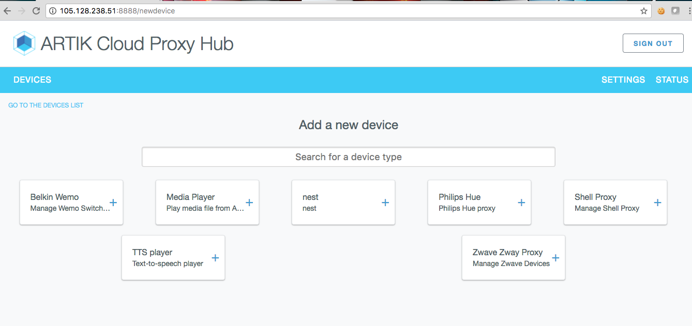
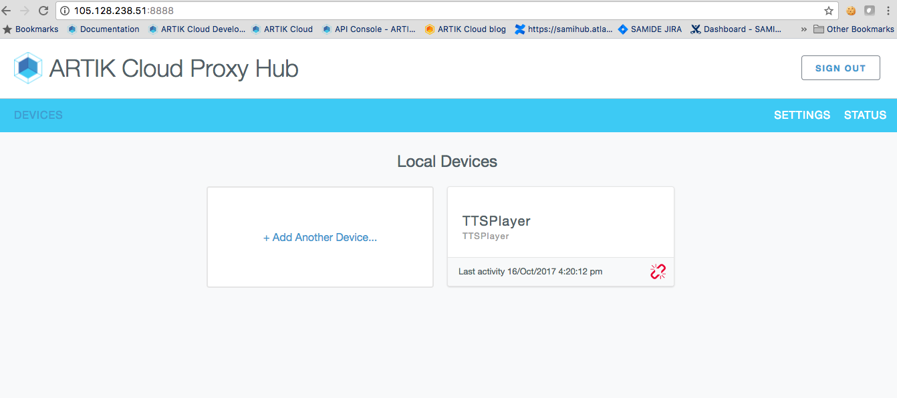
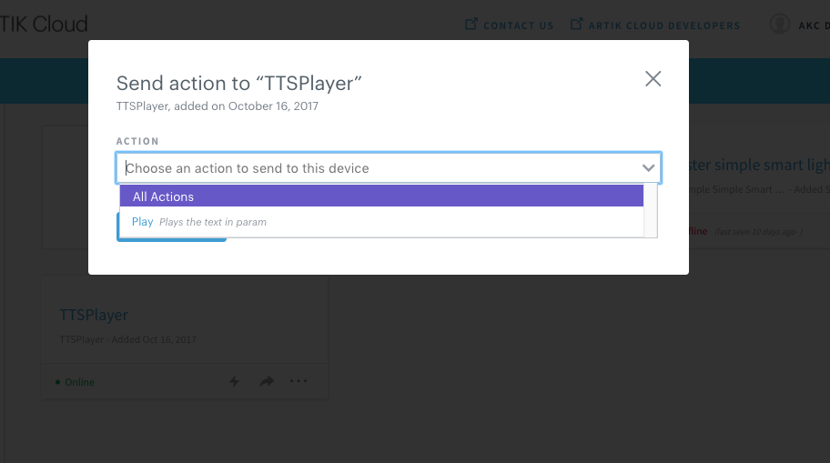

# ARTIK Cloud Proxy Hub

ARTIK Cloud Proxy Hub application is a hub that can link to ARTIK Cloud multiple devices present in your area.

You can use Proxy Hub code in three ways:

1. Use the proxy hub out of box. Follow the [Demo](#demo) section to add and play with devices existing in your local area. Directory `/proxies` lists the supported devices such as Philips Hue, Wemo, Zway et al.
2. Extend this proxy hub by adding a [new proxy](#add-a-new-proxy). Then the hub can talk to more types of devices (not limited to the ones under `/proxies`).
3. Use the code as an example to create your own proxy package that can be distributed to your end users. This way, the end user does not need to perform the steps as the developer in order to use the hub.

## Requirements
@WAITFORENG
- [node](https://nodejs.org/en/download/)  (Version >= 6.5.0????) 
- [npm](https://www.npmjs.com/get-npm) (Version >= 3.10.0????)

## Setup / Installation

 1. Clone this repository if you haven't already done so.

 2. At the root directory and run the command:
    ~~~shell
    npm install
    ~~~

Note it might take up to 1h on a slow computer to finish installation.

## Demo

 1. On a machine with a fixed IP address, run the command to start the server:
    ~~~shell
    npm start
    ~~~
 2. On the terminal, you will see this line:
"GO TO THIS WEBPAGE TO ACCESS THE UI: <url>"
 2. Open a browser and load the above url.
 3. You will be prompted to log in to ARTIK Cloud. After theat, the UI guides you through the hub setup process. At the end of this setup process, you have [created an application](https://developer.artik.cloud/documentation/tools/web-tools.html#creating-an-application) in Developer Dashboard and used the application info to configure the hub. 
 4. Now you can play with the hub. Click "Add Another Device". Then you are prompted to select which type of devices to add. 
 
 There are two types of devices: discoverable by hub and nondiscoverable. The workflow of adding them are different. If a device (e.g. Philips Hue) is discoverable, the hub will search your nearby and give you the opportunity to add it to the ARTIK Cloud. If a device is not discoverable, you must added it manually. For example, "Shell Proxy" and "TTS Player" are not discoverable. 
 4. Lets play with TTS Player in the rest of demo. Click "+" on "TTS Player" and then click "ADD TO ARTIK Cloud". You should see you have a TTS player in the hub.
  
 5. Go to My ARTIK Cloud. You should see an TTS player has been added to your account.
 6. Click that device at My ARTIK Cloud to send an action. e.g. Play "How are you!".
  
 7. You should hear "How are you" from your computer running hub.
 8. If needed, add more devices to ARTIK Cloud using the hub.
 9. Once you have added proxies for your physical devices, you can log off the hub in the browser. **You must keep the server running**. The devices will continue communicate with ARTIK Cloud via proxies on hub. 
 
## Add a new proxy

You can add a new proxy into ARITK Cloud Proxy Hub. Then using the hub, you will be able to add physical devices corresponding to that proxies to the ARTIK Cloud and phsical devices can communicate to ARTIK Cloud via the proxy on the hub.

To create a new proxy , add its folder to the `/proxies` folder. Proxies with a folder starting with '_' are not loaded. _template folder contains an example of what you need to do to create a proxy.

Consult the instruction under `/proxies` to learn more.

## More about ARTIK Cloud

If you are not familiar with ARTIK Cloud, we have extensive documentation at https://developer.artik.cloud/documentation

The full ARTIK Cloud API specification can be found at https://developer.artik.cloud/documentation/api-spec

Check out sample applications at https://developer.artik.cloud/documentation/tutorials/

To create and manage your services and devices on ARTIK Cloud, create an account at https://developer.artik.cloud

Also see the ARTIK Cloud blog for tutorials, updates, and more: http://artik.io/blog/cloud

## License and Copyright

Licensed under the Apache License. See [LICENSE](LICENSE).

Copyright (c) 2017 Samsung Electronics Co., Ltd.

