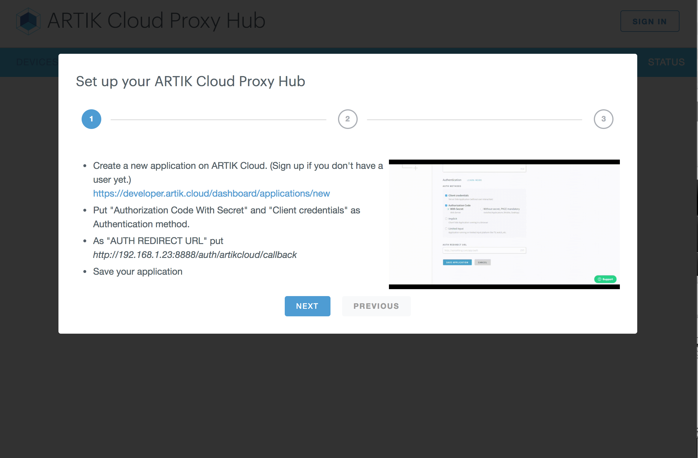

# ARTIK Cloud Proxy Hub

The ARTIK Cloud Proxy Hub is an application that:
 - Discovers your local physical devices,
 - Maps them to existing virtual devices on ARTIK Cloud or new virtual devices that it creates on ARTIK Cloud,
 - Hosts multiple proxies, each of which sends messages/Actions between ARTIK Cloud and one physical device type.

You can use the Proxy Hub repository in three ways:

1. Use the Proxy Hub out of the box. After [setting up](#setup--installation), follow the [Demo](#demo) section to add and play with your nearby devices. The `/proxies` directory includes supported devices, listed below. 
2. Extend this Proxy Hub by adding a [new proxy](#add-a-new-proxy). The hub can then communicate to more types of devices (not limited to the devices listed in `/proxies`).
3. Use the code as an example to create your own proxy package that can be distributed to your end users. 

The following devices are discoverable by the Proxy Hub:

* Philips Hue
* Nest
* Wemo
* Z-Way

The following service devices are available on demand:

* Media Player
* Shell
* TTS Player

**We will add new proxies to this repository. Please check back from time to time.**

## Prerequisites

- [node](https://nodejs.org/en/download/)  (Version >= 4.5.0) 
- [npm](https://www.npmjs.com/get-npm) (Version >= 2.15.9)

## Setup / Installation

 1. Clone this repository.
    ~~~shell
    git clone https://github.com/artikcloud/artikcloud-ProxyHub.git
    ~~~

 2. At the root directory, run the command:
    ~~~shell
    npm install
    ~~~

## Demo

 1. On a machine with a fixed IP address, run the command to start the server:
    ~~~shell
    npm start
    ~~~
 
 2. On the terminal, you will see this line:
"GO TO THIS WEBPAGE TO ACCESS THE UI: <url>"
 
3. Open a browser and load the above URL.
 
4. You will be prompted to login to ARTIK Cloud. After logging in, the UI will guide you through hub setup. At the end of this setup process, you will have [created an application](https://developer.artik.cloud/documentation/tools/web-tools.html#creating-an-application) in the Developer Dashboard and used the application information to configure the hub. 
 
 
 
 5. Now you can play with the hub. Click "Add Another Device", then select a type to add. 
 
 
 
  There are two types of devices: discoverable (by the hub) and on-demand. The steps to add them are different. If a device (e.g. Philips Hue) is discoverable, the hub will search your nearby devices and give you the opportunity to add it to ARTIK Cloud. If a device is available on-demand (e.g. "Shell Proxy" and "TTS Player"), you will add it manually.
 
 6. We will use the TTS Player for the rest of this demo. Click "+" on "TTS Player" and then click "ADD TO ARTIK Cloud". You will see a TTS player listed as a local device.
  
 
 7. Go to [My ARTIK Cloud](https://my.artik.cloud). You should see that a virtual TTS Player device has been added to your ARTIK Cloud Account.
 
 8. Click on this device at My ARTIK Cloud to send an Action. Try playing "How are you!".
  
 
 9. You should hear "How are you" sound on your computer running the hub. The sound is played by the device running on your computer. The Proxy Hub enables the local device to act on Actions sent by ARTIK Cloud.
 
 10. If needed, add more devices to ARTIK Cloud using the hub.
 
 11. Once you have added proxies for your physical devices, you can log off from the hub in your browser. **You must keep the server running**. The devices will continue to communicate with ARTIK Cloud via their proxies on the hub. 
 
## Add a new proxy

You can add a new proxy to the ARTIK Cloud Proxy Hub. Using the hub, you can add physical devices that correspond to the virtual devices in ARTIK Cloud, and physical devices will be able to communicate to ARTIK Cloud via the proxies on the hub.

To create a new proxy, add its folder to the `/proxies` folder. Proxies with a folder starting with '_' are not loaded. The `_template` folder contains an example of what you need to do to create a proxy.

Refer to the instructions under the `/proxies` folder to learn more.

## More about ARTIK Cloud

If you are not familiar with ARTIK Cloud, we have extensive documentation at https://developer.artik.cloud/documentation

The full ARTIK Cloud API specification can be found at https://developer.artik.cloud/documentation/api-reference/

Check out sample applications at https://developer.artik.cloud/documentation/tutorials/

To create and manage your services and devices on ARTIK Cloud, create an account at https://developer.artik.cloud

Also see the ARTIK Cloud blog for tutorials, updates, and more: http://artik.io/blog/cloud

## License and Copyright

Licensed under the Apache License. See [LICENSE](LICENSE).

Copyright (c) 2017 Samsung Electronics Co., Ltd.
