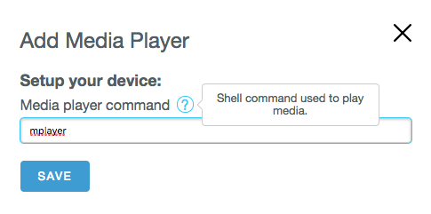

# ARTIK Cloud Proxy

You can extend ARTIK Cloud Proxy Hub by adding a new proxy. This article teaches you how to do it.

**What is a proxy?** 

The proxy can send local device data (sensors) to the cloud and receives action from the cloud (enable actuators).

The proxy is in charge of:
 - Mapping a local device (physical) to an ARTIK Cloud device (virtual)
 - Relaying data from the local device to the cloud
 - Relaying action from the cloud to local device
 - This relaying could be through an hub / intermediate software / manufacturer SDK / protocol (e.g. Zigbee, Z-Wave) / external APIs

## Get started

 - If there is no the corresponding device types for this proxy in ARTIK Cloud yet, create a ARTIK Cloud device type and define the Manifests. Note its Device Type ID (DTID). Please be aware that one proxy can handle devices of multiple device types (e.g. wemo).
 - Duplicate the _template folder in artik-proxy-hub/proxies
 - Rename the folder to a meaningful name (folder name starting with an '_' will not be loaded)
 - Update package.json: 
   -- Fill in "name" field with a meaningful name
   -- Import the API libraries you use in JS file.
 - Update template.js:
   -- Rename it to a meaningful name
   -- Rename Template class
   -- Implement logics relevant to your proxy
 - Update config.json 

The rest of the article discusses how to implement logics in the JavaScript file (the renamed template.js) and how to setup configuration in the config file. 

**All discussion is limited to the files under the renamed "_template" directory unless specified otherwise. The coding discussion is about the JavaScript file unless specified otherwise.**

## Add or discover a device

There are two types of devices: discoverable and on-demand. You implement 'init()' for a discoverable device(e.g. Philips Hue) and 'addNewDevice()' for an on-demaind one (e.g. TTS Player). 

### Discover a device

You implement 'init()' function and remove 'addNewDevice()' in the JavaScript file. In init(), discover local devices, and then declare each of them by emitting a 'newDevice' event. To discover a device, you normally need the libraries provided by the manufacture of that type of devices. 

The following code snippet uses a faked 3rd party device library called 'sdk_bluetoothlock'. For working examples, consult philips-hue and wemo directories.

~~~ javascript
 bleLocker.prototype.init = function () {
  /* Use the appropriate libraries to discover local devices, and then */
  /* emit "newDevice" for each device found. This will display the device 
   * in the hub UI.
   *
   * device_info: device data from the discovered device
   */
  device_info = sdk_bluetoothlock.onDiscover( function(device_info){
    this.emit('newDevice', {
      'proxyDeviceInternalId': device_info.id,
      'proxyDeviceName': device_info.name,
      'proxyDeviceTypeName': 'ProxyDT',
      'akcDtid': 'dt1234',
      'proxyDeviceData': device_info.data
    })
    
    // The following emit function will send a message to ARTIK Cloud. Payload format should be consistent the corresponding device Manifest. Here it is assumed that payload is {'state', boolean}
    this.emit('newMessage', device_info.id, { 'state': device_info.data.status })
  })
  
  // If needed, send status massege to ARTIK Cloud upon state of the device changes
  sdk_bluetoothlock.onNewEvent( function(device_info){
    this.emit('newMessage', device_info.id, { 'state': device_info.data.status })
  })

  sdk_bluetoothlock.startDiscovery()
}
~~~

 - proxyDeviceInternalId: you manage it as you want
 - proxyDeviceName: choose a relevant device name
 - proxyDeviceTypeName: the device type name shown in the hub. You define it.
 - akcDtid: [ARTIK Cloud device type ID](https://developer.artik.cloud/documentation/getting-started/basics.html#device-id-and-device-type)
 - proxyDeviceData: custom data that you manage yourself

For certain fields, you may consider put their values in the config.json and read the values from that file. 

You do not need 'addNewDevice()' for a discoverable device.

### Add an on-demain device

You implement 'addNewDevice()' function and remove 'init()'.

The following code snippet illustrates the implementation of addNewDevice(). For working examples, consult 'shell' and 'mediaplayer' directories.

 ~~~ javascript
Shell.prototype.addNewDevice = function () {
  var name = this._config.public.defaultName
  var id = 'shell.'+Date.now()
 
  this.emit('newDevice', {
    'proxyDeviceInternalId': id,
    'proxyDeviceName': name,
    'proxyDeviceTypeName': 'New Shell Proxy',
    'akcDtid': this._akcDtid,
    'proxyDeviceData': name
  })
 
  // device is off by default
  // Payload format should be consistent the corresponding device Manifest. 
  // Here it is assumed that payload is {'state', string}
  this.emit('newMessage', id, { 'state': 'off' })
  ....
}
 ~~~

## Send data to ARTIK Cloud

The proxy should send status of the devices to ARTIK Cloud from time to time. For example, you can do so in init() function for a discoverable devices (onNewEvent callback in the [code snippet](#discover-a-device)) .

To send, call emit() with 'newMessage' type. Pass in the JSON message that  describes the device status. The message format should be consistent to the corresponding device Manifest defined in ARTIK Cloud.

~~~ javascript
this.emit('newMessage',
  'proxyDeviceInternalId',
  { 'state': 'on' }
)
~~~

## Receive Actions from ARTIK Cloud

For each action defined on the device Manifest, create a function post fixed by "Action". For example, if the Manifest defines Action "setOn", you implements function setOnAction here.

~~~ javascript

Template.prototype.setOnAction = function (proxyDeviceInfo) {
  // actionParams map can be ommited for action with no parameters
}
~~~

If an Action has parameters, you can get them from actionParams as a JSON map:  
~~~ javascript
Template.prototype.setStateAction = function (proxyDeviceInfo, actionParams) {
  // Act on Action to set the state of the device managed by the hub and use
  // received parameter to perform that operation.
}
~~~

## Schedule update

The hub can perform update at a regular interval. For example, get the status of the devices and send them to ARTIK Cloud. To do so, specify 'scheduleUpdate' to be true in config.json and implement scheduledUpdate() function in the JavaScript file as the following example:

~~~ json
// in config file
  "scheduleUpdate": true,
  "scheduleUpdatePeriodMs": 30000,
~~~

~~~ javascript
// in proxy JavaScript file
Template.prototype.scheduledUpdate = function () { 
  // Do device refreshing and status update with ARTIK Cloud
  // Use the value of 'scheduleUpdatePeriodMs' from config.json
}
~~~

## Get the proxy status

On the getStatus() function, you can reflect the status of the proxy. Optionally warn the user on the next action to perform. In the status, 'level' can be 'OK', 'WARNING', or 'ERROR', and the corresponding code is 200, 401, or 403. Below is an example:

~~~javascript
PhilipsHue.prototype.getStatus = function () {
  if (this.hueBridgeLinkButtonHasNotBeenPressed) {
    return {
      'level': 'ERROR',
      'message': 'Please press your Hue Bridge Link Button to discover your lights',
      'code': 403
    }
  }
  else {
    return {
      'level': 'OK',
      'message': '',
      'code': 200
    }
  }
}
~~~

## Add user parameters for proxy

### Define parameters
You can optionally add user parameters for a proxy. For example, use the parameters to store user credentials of the external platform. Define them in the "userParameters" array in the config.json file. The following is "userParameters" of config.json for Nest proxy :
~~~ javascript
public: {
  ...
  "userParameters": [
    {
      "name": "username",
      "value": "",
      "type": "string",
      "description": "NEST account login e-mail"
    },
    {
      "name": "password",
      "value": "",
      "type": "password",
      "description": "NEST account password"
    }
  ],
  ...
}
~~~

### Access parameters

You can access user parameters within the JavaScript code as the following:
~~~ javascript
var userParams = config.public.userParameters
username = userParams[0].value
password = userParams[1].value
~~~

### Update parameters

In the JavaScript code, you can update "userParameters" of config.json. You need to do this if the user modifies the parameters via UI. The following example shows how to change the user name. In the JavaScript code, update the configuration object with the one provided by the user, serialize it as JSON object, and then write it to the config.json:

~~~ javascript
this._config.username = user
var configPath = path.resolve(__dirname, 'config.json')
Fs.writeFileSync(configPath, JSON.stringify(this._config, null, 2))
~~~

### Validate parameters

You could implement validateUserParameters() in the JavaScript code. It checks the parameters provided by the user and throw any JavaScript exception to warn the user when applicable:

~~~ javascript
Template.prototype.validateUserParameters = function (userParams) {
  logger.debug(userParams)
  //Check if userParams are valid.....
}
~~~ 

## Add user parameters for device

You can setup default user parameters for individual devices. Fill in 'userParametersPerDevice' group in the config.json file as the following example:

~~~ json
{
  "userParametersPerDevice": {
    "mediaplayer": {
      "displayName": "Media player command",
      "value": "mplayer",
      "description": "Shell command used to play media."
    },
  },
}
~~~

"userParametersPerDevice" can have multiple objects. For each object (e.g."mediaplayer"), displayName, value and description show on the Web UIs of ARTIK Cloud Proxy Hub. The following UI example match the values in the above json example:

The JavaScript code can access device's user parameters via "proxyDeviceInfo.userParametersPerDevice" object as shown below:
~~~ javascript
 var player = proxyDeviceInfo.userParametersPerDevice.mediaplayer.value
~~~

## Logging

To log, include the logging module and create an logger object in the JavaScript code:
~~~ javascript
var ProxyHubLogger = require('../../lib/proxy-hub-logger.js')
logger = ProxyHubLogger(<name display in log>, <config file of the proxy>)
~~~

**In the root level config.json (not the config.json for each proxy)**, you can specify the logging level(debug, warn, or error) and a log file name. If you do not specify "filename", the logs are displayed on your terminal.

~~~ json
"log": {
  "level": "debug",
  "filename": "log/proxyhub.log"
}
~~~

Blow is an usage example:

~~~json
logger.log('debug', 'Create MediaPlayer proxy')
logger.debug("userParams = " + JSON.stringify(userParams))
~~~

## Mandatory fields in config.json

Your config.json must specify the value of "akcDtNames". It is an array of the display names  of the ARTIK Cloud device types used by your proxy. Below is an example:

~~~json
"akcDtNames": [
  "Belkin WeMo Switch Proxy",
  "Belkin WeMo Insight Switch Proxy"
]
~~~
